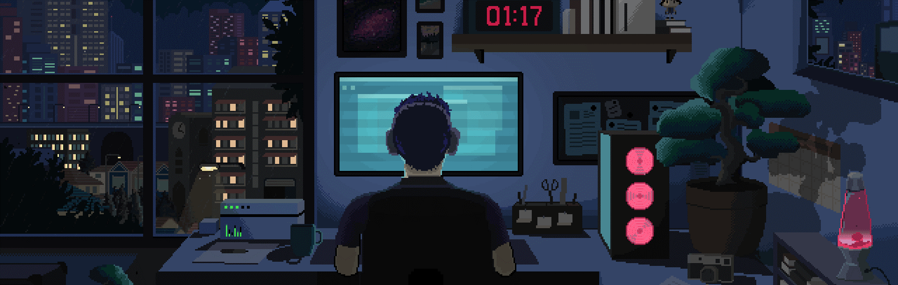

<!-- Full-width GIF Banner -->

  

<h1 align="center">Hi, I'm Aditya K 🤖</h1>

---

### 💬 Quote I live by

  > _"I code, therefore I am. But sometimes, I code, therefore I break things."_

---

### 👋 About Me

Hey, I’m Aditya – an undergrad student - A developer who spends most of his time building things, breaking them, then building them back slightly better (hopefully..) If something isn’t working, you can bet I’ll keep prying at it until I make it bend to my will. When I'm not coding, I’m either playing video games, htting the gym, listening to music, watching football or contemplating whether shawarma is the solution to all of life’s problems (it usually is). And when I’m not doing any of that, I’m probably lost in the world of Computer Graphics, trying to render a scene — because who needs reality, when you can have a glossy teapot casting soft shadows on a perfectly ray-traced checkerboard floor!

Below are a bunch of projects from my dev journey so far, some finished, some half-baked, all part of the ride.

Feel free to explore my work, and don’t shy away from reaching out if you want to chat about code, tech, or anything else!

---

### 🛠️ My Skills

  
  
  
  
  
  
  
  
  
  
  
  
  
  
  
  
  
  
  
  
  
  
  
  
  
  
  
  
  
  
  
  
  
  

---

### 📊 GitHub Stats

  
  

---

### 🔝 Top Repositories

  
  
  

---

### 🌐 Connect With Me

 
   
   

---

  <i>"Still figuring it out... one bug, one breakpoint, and one shawarma at a time."</i>

